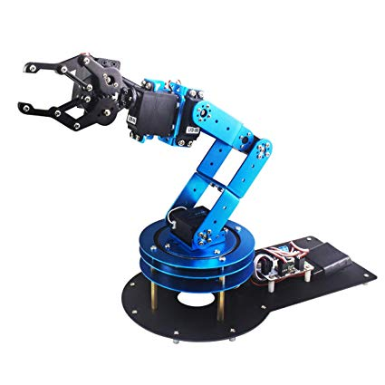

## Motivation: What is Linear Algebra useful for? 

Linear Algebra is arguably the most applicable math subject there is. It is used in almost every aspect of your life. Here are a few examples to motivate you to learn more about it.

### Computer Science Applications

---

**Google is just Linear Algebra**
Have you ever thought about why Google is the number one search engine? 
The main reason is because it is *so* good at ranking webpages in order of relevance when you search some words. 

**The $25,000,000,000 Eigenvector, The Linear Algebra Behind Google:**
**Paper:** https://www.rose-hulman.edu/~bryan/googleFinalVersionFixed.pdf

---

**Robotic Coordinate Frames**

In robotics, coordinate frames are extremely important. 
Let's consider a problem. I give you a robotic arm like the one below:

And I task you to make it pick up a coffee mug off a table. 
Where do we even start? 

First, we define an *origin*, think of the cartesian 3D coordinate system. 

Then we define the *position*, a **vector** of three numbers, *x*,*y*,*z*. Defined as being how far the origin of our arm has moved from an initial position.

And finally, we define an *orientation* vector. *roll*,*pitch*,*yaw*.

The *position* and *orientation* together are a **pose**.

The use for these frames are to know where our arm is with respect to everything else. With our example, it may not seem to complicated, but there are applications where there are tens to hundreds of frames that need to be kept track of so there are no unintended collisions or mishaps.
This is all done with *vectors*, *matrices*, *linear transformations*, and some more linear algebra. 

---

So, now hopefully you are effectively motivated to learn more about linear algebra. But before we dive in, there are some necessary prerequisites.

## Prerequisites
1.) Discrete Math
- Mainly you want to be exposed to some proof techniques before you start linear algebra,
- Also helpful to understand *fields*1*

2.) Basic trig
  

1* https://en.wikipedia.org/wiki/Field_(mathematics)

---

# The building blocks of Linear Algebra
#### Table of Contents:

-Vectors
-Matrices
-Linear Transformations

## Vectors 

To start our journey with linear algebra, we have to begin with the most basic building block, the **vector**.
In their most basic sense, a vector can be thought of a set of coordinates in a cartesian coordinate system. 

### Vectors have a few defined operations
- Addition
- Scalar Multiplication

Addition is defined entry wise:

And scalar multiplication is defined as:

### Linear Combinations

and let the scalars

A **linear combination** of the vectors in $V$ is defined as the following:

One of the many uses of a linear combination of vectors is **Span**

The **Span** of all the vectors in $V$ is *all* the possible combinations of the scalars. Consider the example:
Let $V$ be the set of vectors:

---

## Matrices

<a href="https://www.codecogs.com/eqnedit.php?latex=\textrm{Vectors&space;can&space;be&space;thought&space;of&space;as&space;}&space;$\mathbb{R}^{n&space;\times&space;1}$&space;\textrm{&space;matrices,&space;and&space;scalars&space;}$\mathbb{R}^{1&space;\times&space;1}$&space;\textrm{&space;matrices.&space;They&space;are&space;special&space;cases&space;of&space;matrices&space;though,&space;as&space;we'll&space;see,&space;some&space;operations&space;are&space;not&space;defined&space;with&space;matrices.&space;}" target="_blank"></a>

Let $V$ be a set of vectors, 

We can rearrange the linear combination to be a multiplication of a matrix and a vector. 

That's because matrix multiplication is defined as:

<a href="https://www.codecogs.com/eqnedit.php?latex=\textrm{Where&space;}&space;$AB_{ij}$&space;\textrm{&space;is&space;the&space;entry&space;in&space;the&space;}&space;$i^{\textrm{th}}$&space;\textrm{&space;row&space;and&space;}&space;$j^{\textrm{th}}$&space;\textrm{&space;column&space;of&space;the&space;product&space;of&space;}&space;$A$&space;\textrm{&space;and&space;}&space;$B$.&space;\textrm{&space;It&space;can&space;also&space;be&space;thought&space;of&space;as&space;the&space;dot&space;product&space;of&space;the&space;}&space;$i^{\textrm{th}}$&space;\textrm{&space;row&space;and&space;the&space;}&space;$j^{\textrm{th}}$&space;\textrm{&space;column.&space;}" target="_blank"></a>

Seeing how matrix multiplication is defined, we can also see that . 

## Where to go now?

If you want to keep learning about linear algebra, here are some **free** resources.

[3Blue1Brown Essence of Linear Algebra Video Series](https://youtu.be/fNk_zzaMoSs)
Great for intuitive explanations and amazing visuals.

[MIT Open Courseware](https://ocw.mit.edu/courses/mathematics/18-06-linear-algebra-spring-2010/) is a great intro to linear algebra.  Should be very similar to any undergraduate course taken at a college.

*TODO* Add graphics, add linear transformation section. 
